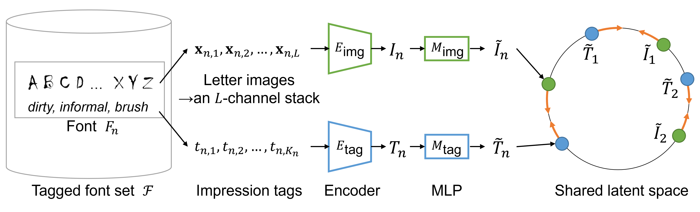

# Impression-CLIP: Contrastive Shape-Impression Embedding for Fonts

[](https://arxiv.org/abs/2402.16350)

Official implementation of the ICDAR 2024 paper:  
**[Impression-CLIP: Contrastive Shape-Impression Embedding for Fonts](https://arxiv.org/abs/2402.16350)**

---

## Overview



**Abstract.** Fonts convey different impressions to readers. These impressions often come from the font shapes. However, the correlation between fonts and their impression is weak and unstable because impressions are subjective. To capture such weak and unstable cross-modal correlation between font shapes and their impressions, we propose ImpressionCLIP, which is a novel machine-learning model based on CLIP (Contrastive Language-Image Pre-training). By using the CLIP-based model, font image features and their impression features are pulled closer, and font image features and unrelated impression features are pushed apart. This procedure realizes co-embedding between font image and their impressions. In our experiment, we perform cross-modal retrieval between fonts and impressions through co-embedding. The results indicate that Impression-CLIP achieves better retrieval accuracy than the state-of-the-art method. Additionally, our model shows the robustness to noise and missing tags.

---

## Dataset Preparation and Preprocessing

We use the **MyFonts** dataset to train and evaluate our model.  
We also use the **word2vec** vocabulary to filter out impression tags that are not included, treating those tags as noise.

### 🔽 Download Resources

- [MyFonts dataset](https://www.cs.rochester.edu/u/tchen45/font/font.html)
- [word2vec GoogleNews model](https://drive.google.com/file/d/0B7XkCwpI5KDYNlNUTTlSS21pQmM/edit?resourcekey=0-wjGZdNAUop6WykTtMip30g)

### ⚙️ Preprocessing

Run the following scripts to preprocess the MyFonts dataset.  
More details can be found in the paper and the header comments of each script.  
The `fontnames` directory contains the list of fonts used in our experiments, as well as the train/validation/test splits.  

```
python preprocess_fonts.py
python preprocess_word2vec_flag.py
python preprocess_tags.py
```

## Training and Evaluation

### 🏋️ Training

1. Pretrain the image encoder `E_img` using the `pretrain.py` script.
2. Train the embedding MLPs `M_img` and `M_tag` using `train.py`.

```
python pretrain.py
python train.py
```

### 📊 Evaluation

Evaluate the model performance using the following script:  
This script computes the **average retrieval rank** for both `img2tag` and `tag2img` retrieval tasks.

```
python quantitative_evaluation.py
```

If you require additional evaluation tools, feel free to contact us:  
📧 **yugo.kubota@human.ait.kyushu-u.ac.jp**


---

## Citation
If you use this code or reference our work, please cite the following:
```
@inproceedings{kubota2024impressionclip,
  author={Kubota, Yugo and Haraguchi, Daichi and Uchida, Seiichi},
  title={Impression-CLIP: Contrastive Shape-Impression Embedding for Fonts},
  booktitle={Proceedings of the 18th International Conference on Document Analysis and Recognition (ICDAR)},
  pages={70--85},
  year={2024}
}
```

---
